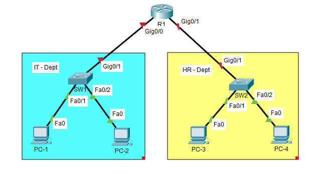
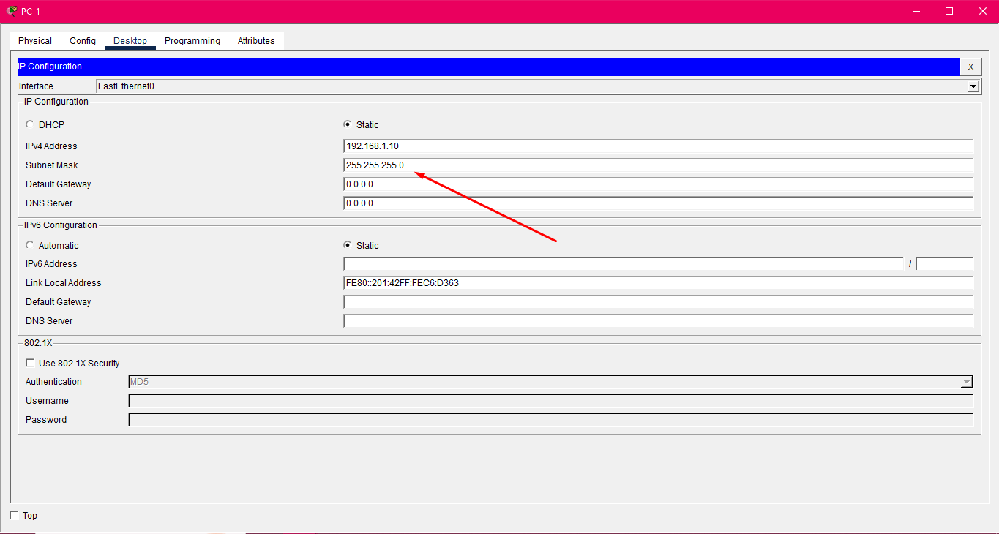
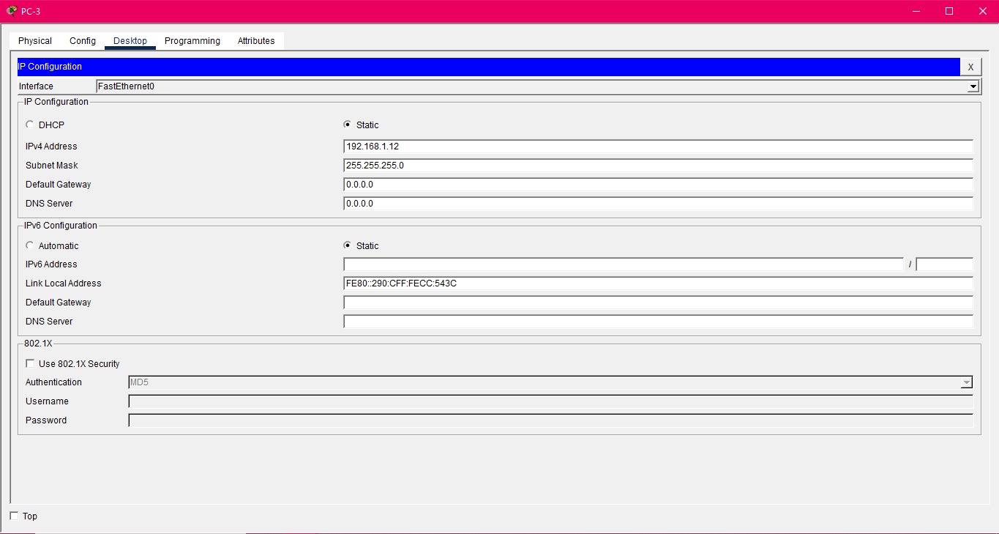
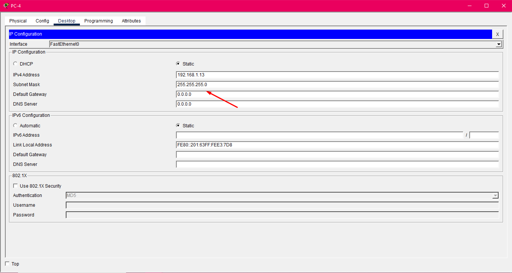

# Part 1: 📁 01-Basic-Network-Setup (Beginner)

## Current Situation

The company has two departments (Sales and IT) sharing the same network 192.168.1.0/24, causing congestion and performance issues



### Requirements

- Configure hostnames on all devices
- Set up console passwords (cisco)
- Configure enable passwords (class)
- Ensure all PCs can ping each other (currently all in same subnet) 

## Walkthrough

So first thing that I would do is to assign ip addresses to each pc in each departments








After that, the next step i do is to go to SW1 and SW2 and I used this following commands to set the hostname, passwords and ensuring that each pc can communicate to each other

```javascript
enable              # Enters privileged EXEC mode, which is required to view or change the running configuration.
config t            # Short for configure terminal, this command enters global configuration mode to start making changes to the device.
hostname SW1/SW2    # Changes the device's prompt name to SW1/SW2. (Note: In a real network, a hostname cannot contain a slash /).
enable secret class # Sets the encrypted password required to enter privileged EXEC mode to class.
line console 0      # Enters the configuration mode for the console port (the physical management port).
password cisco      # Sets the password required to access the console line to cisco.
login               # Enables password checking at the console login prompt, forcing users to enter the password set above.
interface vlan 1    #  Enters configuration mode for the Virtual Interface VLAN 1. This is the logical management interface used to assign an IP address to the switch so it can be managed over the network.
ip address 192.168.1.1 255.255.255.0     # Assigns the IP address 192.168.1.1 and subnet mask 255.255.255.0 to the management interface (VLAN 1).
no shutdown              # Administratively enables the interface (turns it on). By default, VLAN interfaces are often in a "shutdown" (disabled) state.
copy run start            # Saves the current configuration (running-config) to the startup configuration file (startup-config). This ensures the changes will persist if the switch is reloaded or powered off.
```


