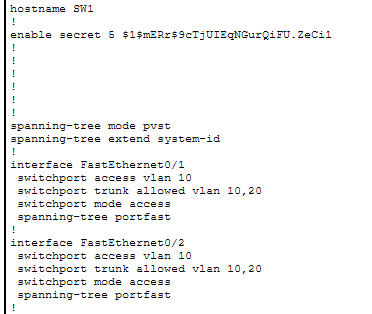
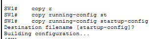
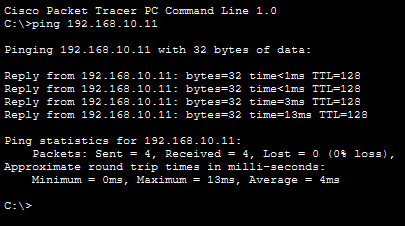
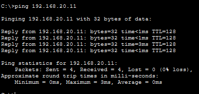

# Part 1: 📁 01-Basic-Network-Setup (Beginner)

## Current Situation

The company has two departments (Sales and IT) sharing the same network 192.168.1.0/24, causing congestion and performance issues


### Requirements

- Configure hostnames on all devices
- Set up console passwords (cisco)
- Configure enable passwords (class)
- Ensure all PCs can ping each other (currently all in same subnet) 

## Walkthrough

So first thing that I would do is to assign ip addresses to each pc in each departments

![PC-1]](image-1.png)

![PC-2]](image-2.png)


    

After that, go to SW1 and SW2 and I used this following commands to set the hostname, passwords and ensuring that each pc can communicate to each other

```javascript
nable
configure terminal
hostname SW1
enable secret class

! Create VLANs
vlan 10
 name IT-Dept
vlan 20
 name HR-Dept
exit

! Configure PC ports for IT Dept (VLAN 10)
interface fastEthernet 0/1
 description Connection to PC-1
 switchport mode access
 switchport access vlan 10
 no shutdown
exit

interface fastEthernet 0/2
 description Connection to PC-2
 switchport mode access
 switchport access vlan 10
 no shutdown
exit

! Configure trunk to SW2
interface gigabitEthernet 0/1
 description Trunk to SW2
 switchport mode trunk
 no shutdown
exit

! Configure trunk to R1
interface gigabitEthernet 0/0
 description Trunk to R1
 switchport mode trunk
 no shutdown
exit

! Console password
line console 0
 password cisco
 login
exit

! Save configuration
copy running-config startup-config
```

### Verify Configurations



the " show run " command will show the current running configurations in the switch, i used this always to verify what i configured.



the " copy run start " command is basically copy running-config startup-config, this command will save the running configuration to the startup-config or basically the NVRAM part of the switch.

REPEAT THE STEPS IN SW1 TO SW2.

## R1 Configurations

```javascript
enable
configure terminal
hostname R1
enable secret class

! Enable physical interface
interface gigabitEthernet 0/0
 description Connection to SW1
 no shutdown
exit

! Configure sub-interface for VLAN 10 (IT Dept)
interface gigabitEthernet 0/0.10
 description Gateway for IT Dept
 encapsulation dot1Q 10
 ip address 192.168.10.1 255.255.255.0
exit

! Configure sub-interface for VLAN 20 (HR Dept)
interface gigabitEthernet 0/0.20
 description Gateway for HR Dept
 encapsulation dot1Q 20
 ip address 192.168.20.1 255.255.255.0
exit

! Console password
line console 0
 password cisco
 login
exit

! Telnet/SSH access
line vty 0 4
 password cisco
 login
exit

! Save configuration
copy running-config startup-config
```

### Key takeaways

My solution addresses network congestion by implementing VLAN segmentation to separate the IT and HR departments into two distinct broadcast domains. VLAN 10 is created for the IT Department with the network 192.168.10.0/24, while VLAN 20 is established for the HR Department with the network 192.168.20.0/24. This isolation ensures that broadcast traffic from one department no longer reaches the other, significantly reducing unnecessary network congestion. The router R1 is configured with sub-interfaces to serve as the default gateway for both VLANs (192.168.10.1 for IT and 192.168.20.1 for HR), enabling inter-VLAN routing only when necessary. This approach improves network performance, enhances security through logical separation, and provides better scalability for future growth

### Ping Results



PC - 1 Command Prompt



PC - 3 Command Prompt
