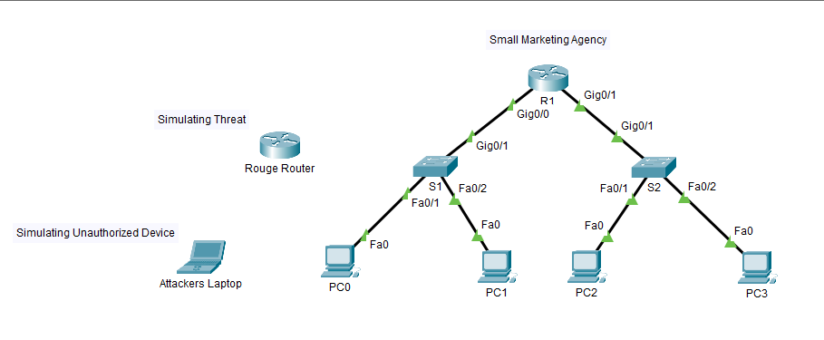
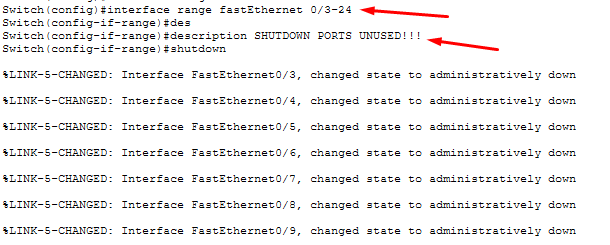
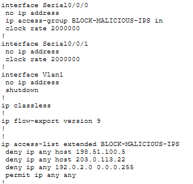
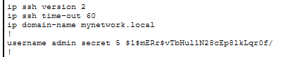
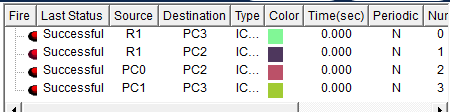

# Beginner Security Fundamentals

- Category : Home Lab
- Status : Finish
- Time Invested : 2 Hours and 45 Minutes

## Goal

Secure the network against common attacks by implementing basic security measures on this small office network.

## Problem

TechStart Solutions, a small marketing agency, has been experiencing security issues:

- 🔴 Last Week: An employee plugged a personal router into the network, creating a rogue DHCP server that gave out wrong IP addresses—knocking everyone offline for 2 hours
- 🔴 Yesterday: Someone connected an unauthorized laptop to an empty office jack and accessed sensitive files
- 🔴 This Morning: The receptionist clicked a link in an email, and now their computer is acting strangely (possible malware)

## Current Situation

The owner is furious and demands you secure the network immediately to prevent:

- Rogue devices connecting
- Unauthorized access
- Malware spreading
- Employees bypassing security

## Topology

## Walkthrough

## Step 1

Configure switch ports to only allow 1 MAC address. If someone unplugs a PC and plugs in a laptop, the port shuts down

## Step 2

Shutting down all unused switch ports

## Step 3

Configure router as the only trusted DHCP server. Block DHCP offers from any other device

## Step 4

Create access-list blocking known malicious IPs and phishing sites

## Step 5

Enable SSH for remote management, disable Telnet

## Result

## Purpose

I completed this cybersecurity-focused networking lab to understand how basic network configurations can prevent real-world attacks—specifically how port security, DHCP snooping, and access-lists stop rogue devices, unauthorized access, and malware communication before they cause damage

## Key Takeaways

1. Basic switch features are powerful security tools—port security alone can stop most physical intrusion attempts
2. DHCP snooping taught me that attackers don't need sophisticated methods; a $20 router plugged into the wall can take down an entire network.
3. Disabling unused ports is free security—every open port is a potential door for an attacker
4. Encrypted management (SSH) is non-negotiable; Telnet sends passwords in plain text that anyone on the network can capture.
5. Logging isn't just for troubleshooting—it's your intrusion detection system telling you when someone tries to breach your defenses.
6. Defense in depth means if one layer fails (like ACLs), another layer (like port security) still protects you
7. Most real-world breaches exploit basic weaknesses—this lab showed me how to close those gaps with configurations I already have

## Conclusion

This activity transformed my understanding of cybersecurity from 'complex firewalls and advanced tools' to recognizing that strong security starts with properly configuring the switches, routers, and ports already in front of me
