# Small Office Network Setup

- Category : Home Lab
- Status : Finish
- Time Invested : 1 Hour and 30 Minutes

## The Problem

A small business just moved into a new office. They have 4 computers and 1 printer, but nothing is connected. Employees can't share files, access the internet, or print documents. The office is completely offline and work has stopped.

## Goal

Set up a fully functional small office network where:

- All 4 computers can communicate with each other
- All computers can send print jobs to the network printer
- The network is secure with basic passwords

### Walkthrough

### Step 1

Physically connect all devices with correct cables

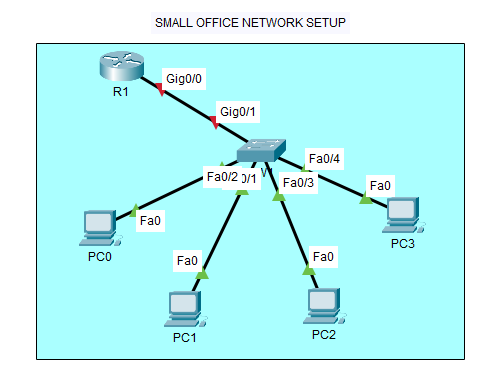

### Step 2

Configured router with hostname and IP address 192.168.1.1

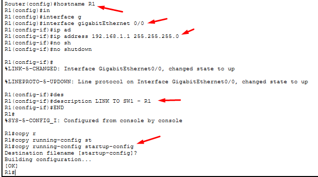

### Step 3

Set console password "cisco" and enable password "class" on router

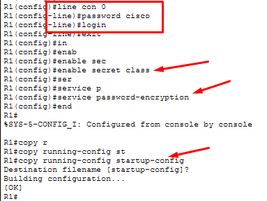

### Step 4

Configured all PCs with IP addresses: 192.168.1.10 through 192.168.1.14

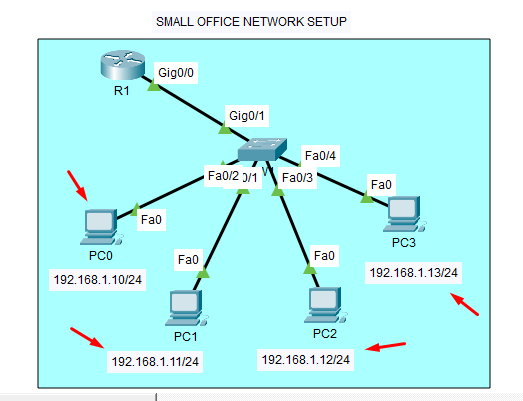

### Step 5

Set default gateway on all PCs to 192.168.1.1

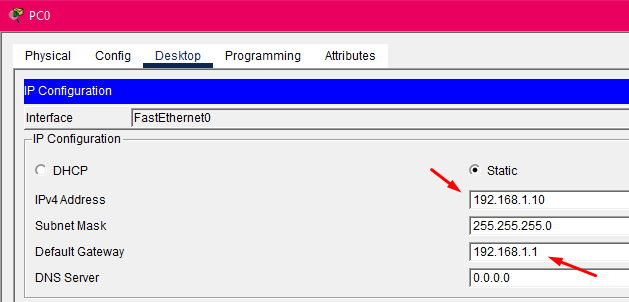

### Step 6

Configured printer with IP 192.168.1.50

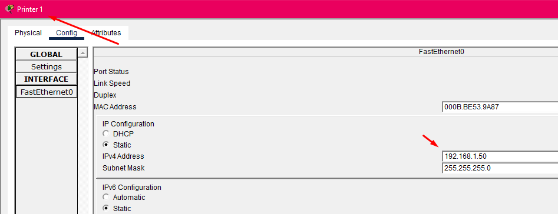

## Testing communication to all devices in the office

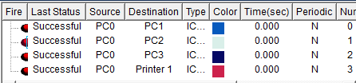

- PC 0 can ping all the devices including the printer

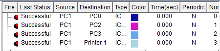

- PC 1 can ping all the devices also

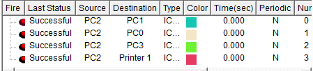

- PC 2 can ping all the devices also

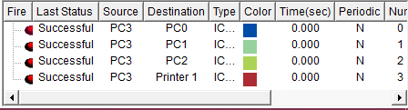

- PC 2 can ping all the devices also

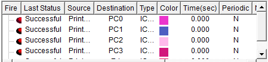

- Printer can ping all the devices also

## Purpose

I did this activity to understand how network security foundations are built—starting with physical connectivity and moving to device hardening through password protection, which prevents unauthorized access to network infrastructure.

## Conclusion

This exercise taught me that cybersecurity isn't just about advanced threats—it begins with basic hygiene like securing routers and switches, controlling who can access network devices, and ensuring the network is configured securely from day one.

- By : Remar Gonzaga Oclarit
