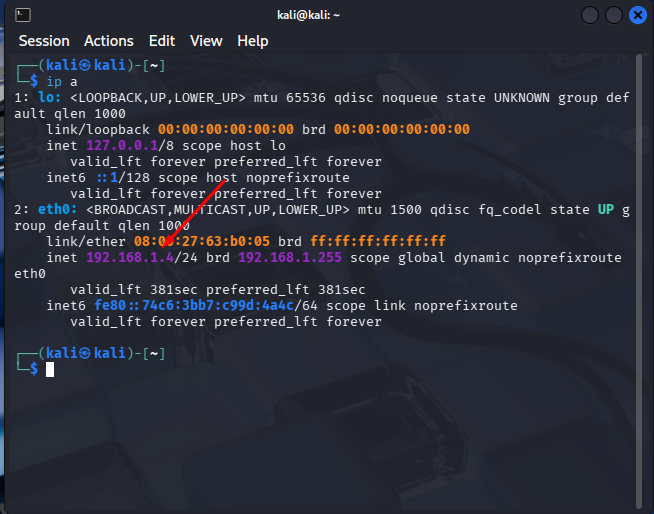
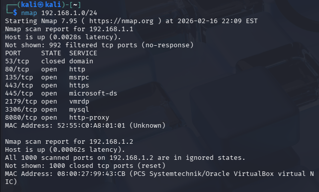
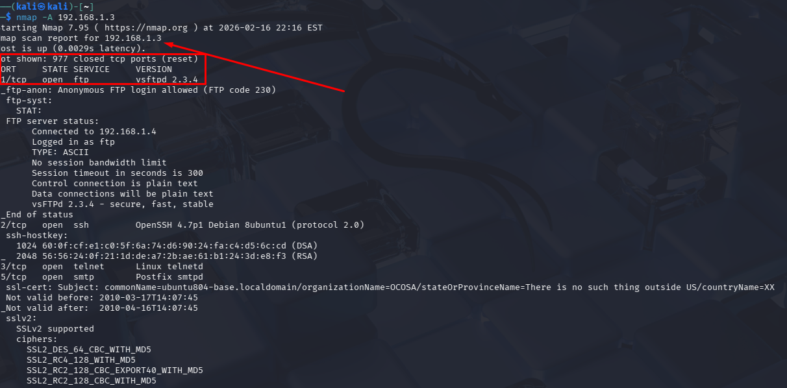
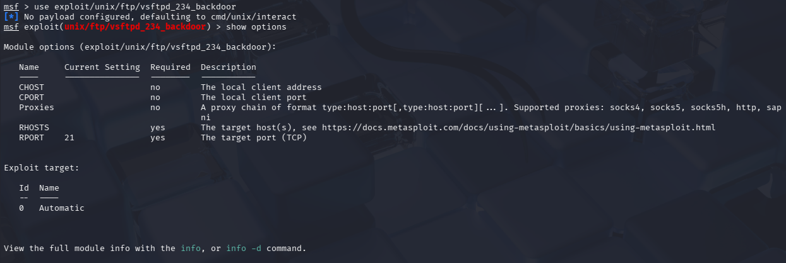
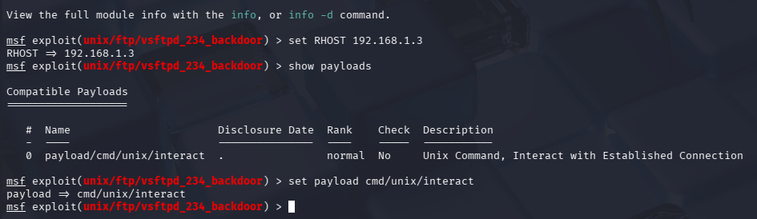
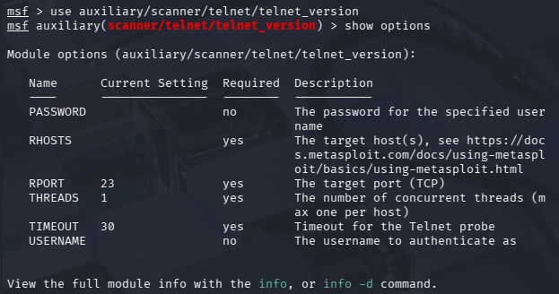
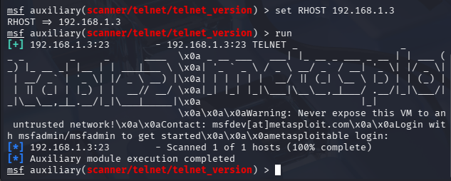

Category: Metasploitable2
Date: 17/02/2026
Status: Finish
Time Invested: 1 Hour

## Quick Facts

Goal: Deploy Vulnerable Machine called Metasploitable 2 in a controlled Environment
Tools Used: VirtualBox and Vulnerable Machine
Difficulty: Beginner

### Wht I did this?

I wanted to create my own controlled environment to test my basic knowledge by the help of this vulnerable machine that I downloaded to Vulnhub.com

## Introduction

Today i will try to penetrate this vulnerable machine and challenge myself to pwned this Metasploitable2 by Rapid7.

### First what is Metasploitable2?

Metasploitable is my own understanding is a intentionally vulnerable Linux virtual machine. This VM can be used to conduct security training, test security tools, and practice common penetration testing techniques.

In my environment i set up a NAT Network called Home-Lab and in this network the attackers ip address is 192.168.1.4/24

Since i dont know whats the Ip address of the Vulnerable VM, i did a full scan in the entire network of 192.168.0/24

After that i notice the Ip address 102.168.1.3/24 has a lot of open ports, and i think this is the VM's ip address.

Since this is a test lab, I won’t be concerned about stealth. Instead, I will try to get the most information out of the scans.

Let’s start by port scanning the target with nmap. I did a full port, aggresive scan against the target. Here are the results.

### What is VSFTPD v2.3.4 Backdoor Command Execution

This module exploits a malicious backdoor that was added to the VSFTPD download archive. This backdoor was introduced into the vsftpd-2.3.4.tar.gz archive between June 30th 2011 and July 1st 2011 according to the most recent information available. This backdoor was removed on July 3rd 2011.

Let's leverage it to get a shell:

Annnnddd we sucessfully owned this machine now!!!

## Port 23 Telnet

For this one I used auxiliary module to know the credentials of this specific port

So now we know the credentials for the msfadmin account, and if you log in and play around you will find out that this accound has sudo privilege, so it’s possible to run commands as root.

## I will continue to exploit another ports in the future
